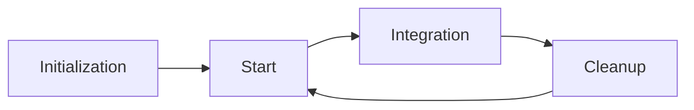

# Git Flow

このリポジトリにおける git 運用の方針を定める。リポジトリの本体ディレクトリ（worktree ではなく、常にベースブランチの最新をチェックアウトしておく場所）では直接作業はしない。変更はすべて作業ブランチと worktree 上で進め、Pull Request 経由で統合する。これにより、レビューを必ず通し、履歴を機能・修正単位で残し、問題発生時に特定コミットへ戻せる状態を保つ。

ライフサイクルは Initialization・Start・Integration・Cleanup の 4 フェーズからなる。全体像を以下に示す。



## Initialization

新規リポジトリを立ち上げるフェーズである。デフォルトブランチを `main` としたパブリックリポジトリを作成し、空コミットで履歴の起点を確立する。`master` は使わない。

```shell
git init -b main
git commit --allow-empty -m "Initial commit"
```

## Start

作業を開始するフェーズである。命名規則に従ったブランチを、ベースブランチの最新コミットから worktree として切り出す。worktree を独立させることで、ブランチを切り替えずに並行作業や緊急対応へ移れる。

ブランチ名は `<type>/<description>` 形式とする。`<type>` は変更の種類を表し、以下から選ぶ。

| type | 用途 |
| :-- | :-- |
| feat | 新機能の追加 |
| fix | バグ修正 |
| chore | コードに直接関係しない変更（ビルド・ツールなど） |
| docs | ドキュメントの変更 |
| refactor | 挙動を変えないコードの整理 |
| test | テストの追加・修正 |

`<description>` は変更内容が一言で伝わる kebab-case の英語動詞句とし、2〜5 語に収める。人名・連番・日付・ `tmp` ・ `wip` のような意味を持たない語は避ける。

| 評価 | 例 |
| :-- | :-- |
| 良い | `feat/add-search-filter` , `fix/login-redirect-loop` |
| 悪い | `feature1` , `tmp` , `yuji-branch` , `20260509` |

worktree はベースブランチ（既定 `origin/main` ）の最新を起点に、リポジトリ配下の `.worktrees/` へ配置する。ディレクトリ名はブランチ名の `/` を `-` に変換した文字列とし、同名の worktree が既にあれば再利用する。

```shell
git fetch origin <base>
git worktree add -b <type>/<description> .worktrees/<dir> origin/<base>
```

## Integration

変更を Pull Request としてリモートへ統合するフェーズである。作業ブランチを push して PR を作成する。独断でマージせず、必ずレビューを依頼し、承認を得てからマージする。履歴を機能・修正単位の 1 コミットへ集約するため、マージ方式は squash に固定する。同一ブランチの PR が既に open であれば、新規に作らず追記 push に留める。

```shell
git push -u origin <type>/<description>
gh pr create --fill
gh pr merge --squash
```

統合を完了するには、worktree から本体ディレクトリへ戻り、自分がマージした PR に限らず origin の最新を fast-forward で取り込んで手元のベースブランチをマージ後の姿に揃える。fast-forward できない場合は、マージコミットを作ったり履歴を分岐させたりせず失敗させ、対応を利用者に委ねる。

```shell
cd "$(git rev-parse --git-common-dir)/.."
git pull --ff-only origin <base>
```

## Cleanup

統合が終わった作業の残骸を削除するフェーズである。worktree とブランチを削除し、関連する GitHub Issue をクローズする。

```shell
cd "$(git rev-parse --git-common-dir)/.."
git worktree remove .worktrees/<dir>
git branch -d <type>/<description>
git push origin --delete <type>/<description>
gh issue close <number> --reason completed
```
