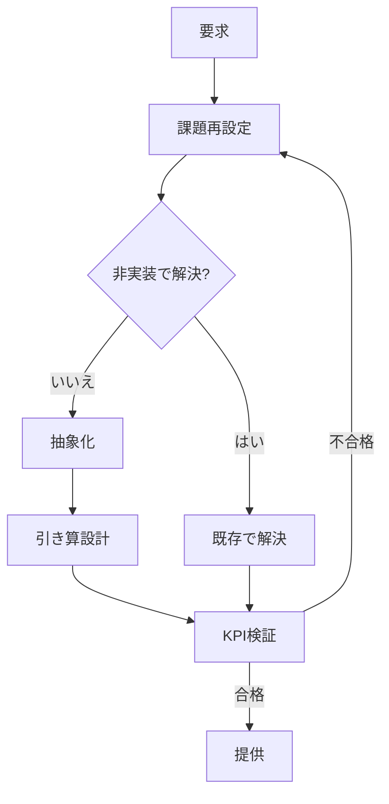

# Product Management

プロダクトに関わるすべての意思決定を「価値提供の最大化」と「要素数の最小化」の両立で導くスキル。プロダクト開発・機能開発・設計・デザイン・コーディングのすべての局面に共通して適用し、何を作るかの前に、何を作らずに課題を解決できるかから考える。

## Principles

意思決定の土台となる3つの原則を示す。後述するKPIとInstructionsはすべてこの原則から導かれる。

- 疑う：仕様や要件をそのまま受け取らず、背後の課題を問う。最善の実装は、実装しないことである。機能追加には実装コストと保守コストが永続的に発生するため、ビルドトラップに陥らず、まず実装しない解決策を検討する。
- 引き算：Simple is the best。機能やコードなどの要素が増えることは、ユーザーと開発者の認知負荷と管理コストの増加である。要素を足して解決するのではなく、価値提供の側面を捉え直して同じ要素数で解決する。引き算の美学と職人的な磨き込みで、シンプルで本質的な美しさを目指す。
- 幹を見る：アイデアとは、複数の課題を同時に解決すべきものである。枝葉への個別対応ではなく、より抽象的で本質的な解決策を探し、設定した課題自体も問い直す。

## KPIs

価値提供の質を「増やした量」ではなく「増やさずに解決した量」で測る。ここでの要素とは、機能・画面・設定項目・API・クラス・条件分岐・依存ライブラリなど、ユーザーまたは開発者が認知し管理しなければならない単位を指す。以下のKPIはプロダクト開発・コーディング・設計・デザイン・機能開発のすべてに共通して適用する。

| KPI | 定義 | 目標 |
| :-- | :-- | :-- |
| 非実装解決率 | 対応した課題のうち、要素を追加せずに解決した割合 | 最大化する。常に非実装の選択肢から検討する |
| 課題解決レバレッジ | 解決した課題数 ÷ 追加した要素数 | `2` 以上。1つの解が複数の課題を解決する |
| 純要素増分 | 追加した要素数 − 削除した要素数 | `0` 以下を基本とし、追加する場合も最小に抑える |
| 分岐増分 | 条件分岐・特殊ケース・設定項目の増減 | `0` 以下。一般化により分岐そのものをなくす |
| 価値到達ステップ数 | ユーザーが課題解決に至るまでの操作と理解の手数 | 変更前より増やさない |
| 一文説明性 | 変更の価値をユーザー視点の1文で説明できるか | 常に説明できる |

## Instructions

KPIを達成するため、あらゆる要求とタスクに対して以下の5ステップを順に適用する。全体の流れを図に示す。

### Reframe

表明された要求をそのまま実装対象にしない。要求は解決策の一形態にすぎず、本当の対象はその背後にある課題である。

- 「なぜ」を繰り返し、要求の背後にある課題を解決策から独立した1文で言語化する。
- 誰が、どの場面で、何に困っているのかを特定する。
- 設定した課題自体を問い直す。そもそも解くべき課題か、より上位の課題はないかを検討する。

複数の要求が届いているときほど効果が大きい。別々に見える要求が同じ課題の異なる表現であることは多く、このステップの精度が一文説明性と課題解決レバレッジを決める。

### No-Build

最善の実装は、実装しないことである。追加した要素には実装コストに加えて、保守・テスト・ドキュメント・認知のコストが永続的に発生する。実装に進む前に、以下の非実装の解決策を順に検討する。

- 既存機能の組み合わせや別用途での活用
- 設定・データ・運用の変更
- ドキュメントや導線の改善
- 課題の原因となっている機能や制約の削除

いずれかで解決できるなら実装しない。検討の結果は提案や成果物に明記し、非実装解決率と純要素増分を直接改善する。

### Abstract

非実装で解決できない場合も、目の前の1課題への個別対応から始めない。アイデアとは複数の課題を同時に解決すべきものであり、枝葉ではなく幹を見る。

- 周辺の課題を列挙し、共通する根本原因を特定する。
- 新しい概念を追加するのではなく、既存概念の一般化や捉え直しで解けないかを検討する。
- 解が1つの課題しか解決しないなら、抽象度を1段上げて再考する。

課題解決レバレッジ `2` 以上はこのステップで達成する。

### Subtract

実装する場合も、足し算ではなく引き算で設計する。完成とは付け加えるものがなくなったときではなく、取り除くものがなくなったときである。

- 条件分岐・特殊ケース・設定項目を1つずつ疑い、一般化やデフォルト化でなくせないかを検討する。
- 要素を1つ追加するたびに、削除できる既存要素を探す。
- ユーザーと開発者の認知負荷を基準に、最も分かりやすい形へ磨き込む。

純要素増分・分岐増分・価値到達ステップ数はこのステップで抑える。

### Verify

提供の前にKPIで変更を検証し、合格するまで Reframe に戻る。

- 変更の価値をユーザー視点の1文で説明する。説明できなければ課題設定に誤りがある。
- 要素数・分岐数・価値到達ステップ数の増減を実際に数える。
- Checklist で最終確認する。

## Checklist

意思決定や成果物の提出前に以下を確認する。

| 観点 | 確認内容 |
| :-- | :-- |
| 課題 | 要求ではなく課題を対象にしたか。課題自体を問い直したか |
| 非実装 | 実装しない解決策を先に検討し、その結果を説明できるか |
| レバレッジ | 解は複数の課題を同時に解決しているか |
| 引き算 | 要素・分岐・ステップは増えていないか。削れるものを削り切ったか |
| 説明 | 変更の価値をユーザー視点の1文で説明できるか |
