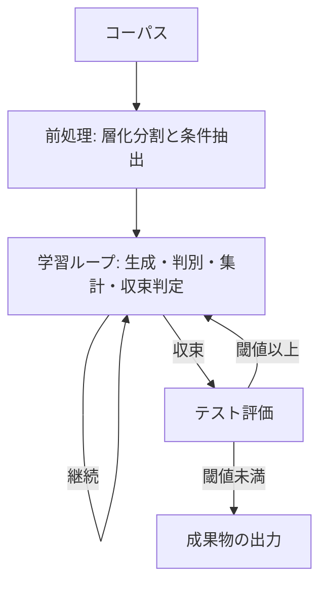

# Style Rubric Distillation

特定の書き手の文体を、実例ではなく規則の記述（ルーブリック）として蒸留し、その規則を読ませるだけで同じ文体の文章を生成できるようにする手順である。外部の API キーは使わない。呼び出しはすべて Claude 自身が行う言語モデル呼び出しであり、統計計算とデータ分割だけを `scripts/` の Python が担う。この手順は、ルーブリックをパラメータとする片側 GAN（敵対的プロンプト最適化）である。通常の GAN と異なり、Generator 自体は学習させず、Generator に与えるルーブリックだけを最適化する。

## Terms

| 機械学習の語 | この手順での実体 |
| :-- | :-- |
| Generator | ルーブリックと条件入力を読んで文章を書く言語モデル呼び出し。固定の推論器であり、最適化対象ではない |
| Discriminator | 見本を参照し、提示された `1` 件の文章が本人の筆か生成文かを判定する言語モデル呼び出し |
| パラメータ | ルーブリック。学習ループで更新される唯一の対象 |
| 勾配 | Discriminator が出力した判定根拠のテキスト。数値ではなく言語で表現された更新方向 |
| 見破られ率 | Discriminator の正答率。 `0.5` に近いほど生成文と本人の文章の区別がついていないことを表す |
| 条件入力 | 文章のネタ。本人の文章から内容の骨子だけを逆抽出したもの |
| エポック | `1` ラウンド。生成・判定・ルーブリック更新からなる |
| バッチサイズ | `1` エポックで Discriminator にかけるサンプル数 |

## Input

単一の書き手による、同一ジャンルの文章のコーパスを、次の形式の JSON で用意する。

```json
[
  {"id": "一意な識別子", "text": "本文", "date": "YYYY-MM-DD（任意）", "topic": "話題の札（任意）"}
]
```

`date` と `topic` は省略できるが、`topic` を付けるなら全件に付ける。 `60` 件以上を推奨する。 `30` 件未満のときは `scripts/split.py` が理由を示して終了コード `1` で停止する。代替の経路は設けない。

## Flow



## Preprocessing

`scripts/split.py` でコーパスを学習・検証・テストへ `7` : `2` : `1` の比率で層化分割する。

```shell
python3 skills/style-rubric/scripts/split.py corpus.json --seed <乱数の種> > split.json
```

学習データはルーブリック生成の材料および Discriminator への見本、検証データは条件抽出の材料および判別バッチの本人側、テストデータはテスト評価専用で学習ループ中は参照しない。出力の `seed` ・ `total` ・ `counts` ・ `strata` は `report.md` の分割の内訳へ転記する。検証データとテストデータの各文章に `prompts/condition.md` を一度ずつ呼び出し、条件入力を作る。この条件入力は以降の全エポックとテスト評価を通じて固定し、取り直さない。生成文はルーブリックが変わるたびに作り直す。

## Training Loop

閾値は見破られ率 `0.6` 未満とする。バッチサイズは検証データ件数の `2` 倍で決まる。エポック数に上限はなく、収束するかアサーションが崩れるまで回り続ける。収束しないまま続く場合は `report.md` の推移を見て人が止める。

1. **生成**：検証データの各条件入力に現在のルーブリックを添えて `prompts/generator.md` を呼び出し、生成文を作る。
2. **判別バッチ**：検証データの本人の文章（全件）と対応する生成文（同数）を組み合わせ、提示順序をランダム化する。
3. **判別**：バッチの `1` 件ずつを独立に `prompts/discriminator.md` へ渡す。見本は学習データを使う。正解・判定・判定根拠を記録する。
4. **集計**：`{"truth": ..., "verdict": ...}` の一覧を `scripts/epoch.py` に渡す。

   ```shell
   python3 skills/style-rubric/scripts/epoch.py judgments.json > epoch_result.json
   ```

   「本人」と答えた割合が `0.3` 〜 `0.7` の範囲を外れると、`epoch.py` は理由を示して終了コード `1` で異常終了する。バッチが本人と生成文の半々である以上、これは Discriminator が中身を見ずに一方へ倒れていることを意味し、見破られ率は解釈できない。
5. **収束判定**：`deception_rate` が `0.6` 未満なら収束としてテスト評価へ進む。 `0.6` 以上なら、バッチの全判定根拠を `<verdict_reasons>` 、直前のルーブリックを `<previous_rubric>` 、学習データを `<training_data>` として `prompts/rubric.md` を呼び出し、更新したルーブリックで次のエポックへ進む。 `p_value` は判断の確からしさを示す併記の指標であり、収束の判定基準そのものではない。

## Test Evaluation

収束後、テストデータの本人の文章（全件）と、固定済みの条件入力から収束後のルーブリックで作った生成文（同数）で、手順 `3` ・ `4` と同じ判別を `1` 回行う。見破られ率が閾値未満なら成果物の出力へ進む。閾値以上なら過適合とみなし、そのときの判定根拠を手順 `5` と同じ形でルーブリック生成へ渡して学習ループへ戻る。テストデータはコーパスの `1` 割しかなく信頼度は高くないため、閾値を下回ったことを過度に信頼しない。

## Measurement Limits

見破られ率が `0.5` に近づくことは、生成文の分布が本人の分布に一致した状態と、Discriminator に本人の文体を見分ける力がなく当てずっぽうで答えている状態のどちらでも成立し、区別できない。手順 `5` の「本人」と答えた割合の検査は、一方の答えへ倒れる退化だけを捕まえる。ランダムに答えている場合はこの内訳も半々になり、収束と同じ姿になる。収束を、書き手の文体を再現できたことの証明として提示しない。

## Independence

`prompts/` の全プロンプトの呼び出しは、Claude のメモリ機能を使わない。過去の呼び出しの記憶を参照させず、その場で渡した入力だけを文脈とする。エポックをまたいで持ち越してよい状態はルーブリックだけである。記憶が残ると、Discriminator は既知文の照合になって見破られ率が不当に高く出るか、Generator が正解を見て書いて見破られ率が不当に下がる。

## Output

収束後、テスト評価も通過したら、利用者の作業ディレクトリへ次の `3` つを書き出す。

- `rubric.md` — 収束したルーブリックそのもの
- `generate_prompt.md` — `prompts/generator.md` の `<rubric>` に収束したルーブリックの全文を埋め込んだプロンプト
- `report.md` — 下記の型に従った記録

## Report

`report.md` は次の `6` 節からなる。各節の数値は `split.py` ・ `epoch.py` の出力を書き写して組み立て、計算し直さない。

| 節 | 内容 | 出典 |
| :-- | :-- | :-- |
| 分割の内訳 | 乱数の種・総件数・集合ごとの件数・層ごとの内訳 | `split.py` の `seed` ・ `total` ・ `counts` ・ `strata` |
| エポックの推移 | エポックごとの見破られ率・p 値・混同行列・判定 | 各エポックの `epoch.py` の `deception_rate` ・ `p_value` ・ `confusion` |
| テスト評価 | サンプル数・見破られ率・p 値・混同行列・判定 | テストデータでの `epoch.py` 出力一式 |
| 更新の履歴 | エポックごとの採用・却下した特徴の件数と修正項目の要約 | `prompts/rubric.md` の出力末尾 |
| 見破られ続けた特徴 | 収束後もなお判定根拠に繰り返し現れた特徴。無ければ「なかった」と明記 | 各エポックの Discriminator の `reasoning` |
| 測定の限界 | 見破られ率 `0.5` が Discriminator の無力でも成立するという留保 | 本書 Measurement Limits の文言を転記 |

## Diagnostics

| 症状 | 原因 | 対処 |
| :-- | :-- | :-- |
| 見破られ率は下がるが文章が薄い | Discriminator を騙す方向に最適化が進んでいる | ルーブリックに内容密度の項目を追加する |
| 検証データで閾値未満、テストデータで閾値以上 | 検証データへの過適合 | ルーブリックから固有名詞と具体フレーズを除去する |
| 見破られ率が上下して収束しない | バッチサイズ不足 | 検証データ件数を増やし、バッチサイズを `40` 以上にする |
| 見破られ率は下がるが生成文が本人らしくない | Discriminator を固定したことによる局所解 | 着眼点の異なる Discriminator を複数用意し、多数決へ切り替える |
| 初回から見破られ率が閾値未満 | Discriminator が本人の文体を捉えられていない疑い | 見本を増やし、判定前に着眼点を列挙させて再実行する |
| エポックを重ねても閾値を割らない | ルーブリックで表現しきれない特徴が残っている | `report.md` の見破られ続けた特徴を確認し、人が止める |

判別結果が「本人」に `0.3` 〜 `0.7` の範囲外で偏る症状は、手順 `4` のアサーションとして自動で検査され停止として現れるため、この表に載せない。局所解の症状が観測された場合は、着眼点ごとに `prompts/discriminator.md` のバリエーションを用意し、同じサンプルを全バリエーションへ判定させ、多数決で交代する。集計は判定を一つの一覧にまとめて `scripts/epoch.py` へ渡せばよい。
