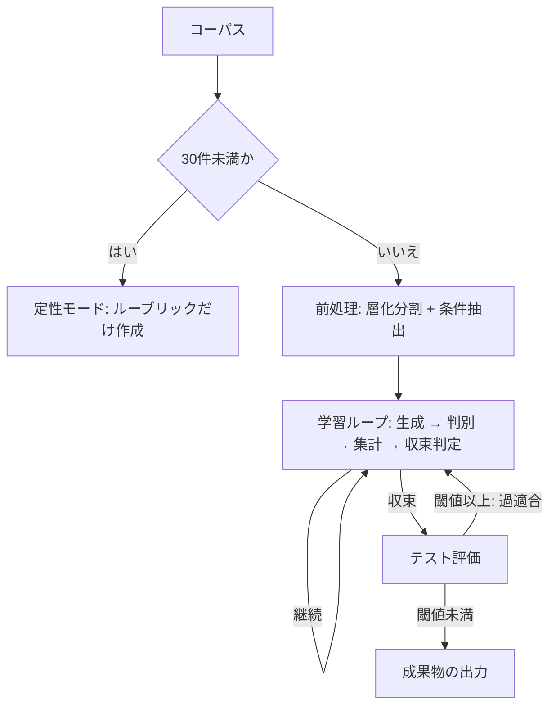

# Style Rubric Distillation

特定の書き手の文体を、実例そのものではなく**規則の記述（ルーブリック）**として蒸留し、その規則を読ませるだけで同じ文体の文章を生成できるようにする手順である。外部の API キーは使わない。呼び出しはすべて Claude 自身が行う言語モデル呼び出しであり、統計計算とデータ分割だけを `scripts/` の Python が担う。

## 定式化

この手順は、ルーブリックをパラメータとする**片側 GAN（敵対的プロンプト最適化）**である。通常の GAN と異なり、Generator（文章を書く役）自体は学習させず、Generator に与えるルーブリックだけを最適化する。

| 機械学習の語 | この手順での実体 |
| :-- | :-- |
| Generator | ルーブリックと条件入力を読んで文章を書く言語モデル呼び出し。固定の推論器であり、最適化対象ではない |
| Discriminator | 見本を参照し、提示された1件の文章が本人の筆か生成文かを判定する言語モデル呼び出し |
| パラメータ | ルーブリック。学習ループで更新される唯一の対象 |
| 勾配 | Discriminator が出力した判定根拠のテキスト。数値ではなく言語で表現された更新方向 |
| 見破られ率 | Discriminator の正答率。0.5に近いほど生成文と本人の文章の区別がついていないことを表す |
| 条件入力 | 文章のネタ。本人の文章から内容の骨子だけを逆抽出したもの |
| エポック | 1ラウンド。1回分の生成・判定・ルーブリック更新からなる |
| バッチサイズ | 1エポックで Discriminator にかけるサンプル数 |

## 入力

単一の書き手による、同一ジャンルの文章のコーパスを、次の形式の JSON で用意する。

```json
[
  {"id": "一意な識別子", "text": "本文", "date": "YYYY-MM-DD（任意）", "topic": "話題の札（任意）"}
]
```

`date` と `topic` は省略できるが、`topic` を付けるなら全件に付ける（一部だけへの付与は許されない）。60件以上を推奨する。

## 全体の流れ



## 定性モード（30件未満）

コーパスが30件未満のときは、`scripts/split.py` が終了コード1で「30件を下回るため統計的な収束判定は成立しません」と標準エラー出力へ書いて止まる。この停止を代替値でごまかさず、そのまま次の対応に切り替える。

学習ループは回さない。コーパス全件を学習データとみなし、`prompts/rubric.md` を1回だけ呼び出す。`<previous_rubric>` と `<verdict_reasons>` は空のまま渡し、判別・収束判定・テスト評価は行わない。出力される `rubric.md` には、定性モードで作成したものであり見破られ率による検証を経ていない旨を明記する。

## 前処理

学習ループの外側で、独立に一度だけ行う。

### データ分割

`scripts/split.py` でコーパスを学習・検証・テストの3集合へ7:2:1で層化分割する。

```shell
python3 skills/style-rubric/scripts/split.py corpus.json --seed <乱数の種> > split.json
```

- 学習データ（70%）：ルーブリック生成の材料。および Discriminator へ渡す見本
- 検証データ（20%）：条件抽出の材料。および判別バッチの本人側サンプル
- テストデータ（10%）：テスト評価専用。学習ループ中は一度も参照しない

出力には種・総件数・集合ごとの件数・層（時期・長さ・話題の組み合わせ）ごとの内訳・集合ごとの id 一覧が入る。この内訳は `report.md` の「分割の内訳」節へそのまま転記する。

### 条件抽出

検証データに含まれる文章1件ごとに `prompts/condition.md` を呼び出し、内容の骨子だけを逆抽出した**条件入力**を作る。同じ操作をテストデータの全件にも一度だけ行う（テスト評価でも本人と同じネタで生成文を作る必要があるため）。

作った条件入力は、以降の全エポックおよびテスト評価を通じて固定して使い回す。取り直さない。条件入力を固定するのは、見破られ率の変化がルーブリックの改善によるものか題材の変化によるものかを切り分けるためである。生成文自体はルーブリックが変わるたびに作り直す。

## 学習ループ

閾値の既定値は見破られ率 0.6 とする。バッチサイズは手順2のとおり検証データ件数×2で自動的に決まり、既定値という形の設定項目は持たない。1エポックは次の手順からなり、エポック数に上限は設けない。収束するか、後述のアサーションが崩れて停止するまで回り続ける。収束しないまま回り続ける場合は `report.md` の推移を見て人が止める。

1. **生成**：検証データの各条件入力について、現在のルーブリックとともに `prompts/generator.md` を呼び出し、生成文を1件ずつ作る。検証データの件数と同数の生成文ができる。
2. **判別バッチの構成**：検証データの本人の文章（全件）と、対応する条件入力から作った生成文（同数）を組み合わせ、本人と生成文が半々のバッチを作る。バッチサイズは検証データ件数×2になる。提示順序をランダム化する。
3. **判別**：バッチの1件ずつを独立に `prompts/discriminator.md` へ渡す。見本には学習データを使う。比較対象は与えず、1サンプルだけを提示する。各判定について、正解（本人／生成文）・判定・判定根拠を記録する。
4. **集計**：記録した `{"truth": ..., "verdict": ...}` の一覧を `scripts/epoch.py` に渡し、混同行列・見破られ率・p 値・「本人」と答えた割合を求める。

   ```shell
   python3 skills/style-rubric/scripts/epoch.py judgments.json > epoch_result.json
   ```

   「本人」と答えた割合が0.3〜0.7の範囲を外れると、`epoch.py` は理由を示して終了コード1で異常終了する。バッチが本人と生成文の半々である以上、Discriminator が中身を見ずに一方へ倒れていることを意味し、見破られ率は解釈できない。これは条件分岐ではなくアサーションであり、代替値で続行せずその場で停止する。
5. **収束判定**：異常終了しなければ、`epoch_result.json` の `deception_rate` を見る。
   - **0.6未満**：収束とみなし、テスト評価へ進む。
   - **0.6以上**：バッチ内の全判定根拠を `prompts/rubric.md` の `<verdict_reasons>` へ渡し、直前のルーブリックを `<previous_rubric>` へ、学習データを `<training_data>` へ渡してルーブリックを更新する。更新は `prompts/rubric.md` が定める採用基準と手順に従う。更新後のルーブリックを持って次のエポックへ進む。

   `epoch_result.json` の `p_value` は、見破られ率と偶然（0.5）との差が統計的にどれだけ確からしいかを示す併記の指標であり、収束の判定基準そのものではない。バッチサイズが小さいほど p 値は緩くなる（偶然でも起こりうる範囲が広がる）ため、`report.md` へ必ず併記する。

各エポックの `epoch_result.json` と、ルーブリック更新で採用・却下した特徴の件数は、そのままエポックの記録として保持し、`report_template.md` に従って `report.md` へ積む。

## テスト評価

学習ループが収束したら、テストデータで一度だけ同じ形式の判別を行う。テストデータの本人の文章（全件）と、前処理で固定したテスト用条件入力から収束後のルーブリックで作った生成文（同数）を組み合わせ、学習ループと同じ手順（3の判別・4の集計）を1回だけ実行する。見本は学習データのままである。

- **見破られ率が閾値未満**：検証データへの過適合ではないと判断し、成果物の出力へ進む。
- **見破られ率が閾値以上**：検証データへの過適合とみなし、そのときの判定根拠を学習ループの手順5と同じ形でルーブリック生成へ渡し、学習ループへ戻る（収束するまでエポックを重ね、再びテスト評価を行う）。

テストデータはコーパスの1割しかない。60件のコーパスでは12サンプルでの判定になり、信頼度は高くない。テスト評価は明らかな過適合を捕まえる粗い網と位置づけ、閾値を下回ったことを過度に信頼しない。

## 測定の限界

見破られ率が0.5に近づくことは、次の2つの状態のどちらでも成立し、この構成では区別できない。

- 生成文の分布が本人の分布に一致した（求めている状態）
- Discriminator にそもそも本人の文体を見分ける力がなく、当てずっぽうで答えている

手順5・テスト評価で検査している「本人と答えた割合」の内訳は、Discriminator が中身を見ずに一方の答えへ倒れている退化だけを捕まえる。ランダムに答えている場合はこの内訳も半々になり、収束と同じ姿になるため見分けられない。したがって見破られ率が閾値を割ったことは「この Discriminator が区別できなかった」以上のことを意味しない。収束を、書き手の文体を再現できたことの証明として提示しない。

## エージェントの独立性

`prompts/condition.md`・`prompts/generator.md`・`prompts/discriminator.md`・`prompts/rubric.md` のいずれの呼び出しも、Claude のメモリ機能を使わない。過去の呼び出しの記憶を参照させず、その場で明示的に渡した入力だけを文脈とする。

エポックをまたいで持ち越してよい状態はルーブリックだけである。記憶が残ると測定が汚染される。Discriminator が過去に見た文章を覚えていれば既知文の照合になり見破られ率が不当に高く出る。Generator が検証データの本文を覚えていれば条件入力を経由せず正解を見て書くことになり見破られ率が不当に下がる。

## 成果物の出力

収束後、テスト評価も通過したら、利用者の作業ディレクトリへ次の3つを書き出す。

- `rubric.md` — 収束したルーブリックそのもの
- `generate_prompt.md` — `prompts/generator.md` の `<rubric>` 部分に収束したルーブリックの全文を埋め込み、条件入力だけを渡せば同じ文体の文章を書ける形にしたプロンプト
- `report.md` — `report_template.md` の型に従い、分割の内訳・エポックごとの見破られ率とp値と混同行列・テスト評価の結果・主な更新の履歴・最後まで見破られ続けた特徴・測定の限界を記した記録

`report.md` には、収束後もなお判定根拠に繰り返し現れていた特徴（採用しきれなかった、または採用しても生成文に再現しきれなかった特徴）を必ず記録する。それがその書き手の再現しにくい核であり、次に手を入れるべき場所である。

## 診断

| 症状 | 原因 | 対処 |
| :-- | :-- | :-- |
| 見破られ率は下がるが文章が薄い | Discriminator を騙す方向に最適化が進み、内容密度が犠牲になっている | ルーブリックに内容密度の項目を追加する |
| 検証データで閾値未満、テストデータで閾値以上 | 検証データへの過適合 | ルーブリックから固有名詞と具体フレーズを除去し、規則記述に書き直す |
| 見破られ率が上下して収束しない | バッチサイズ不足 | 検証データ件数を増やし、バッチサイズ（検証データ件数×2）を40以上にする |
| 見破られ率は下がるが、生成文が本人らしくない | Discriminator を固定したことによる局所解 | 着眼点の異なる Discriminator プロンプトを複数用意し、交代または多数決アンサンブルに切り替える（下記） |
| 初回から見破られ率が閾値未満 | 収束ではなく Discriminator が本人の文体を捉えられていない疑い | Discriminator に見せる見本を増やし、判定前に着眼点を列挙させて再実行する |
| エポックを重ねても見破られ率が閾値を割らない | ルーブリックで表現しきれない特徴が残っている | `report.md` の「最後まで見破られ続けた特徴」を確認し、人が判断してループを止める |

判別結果が「本人」に0.3〜0.7の範囲外で偏る症状は、この表に載せない。手順5のアサーションとして毎エポック自動で検査され、診断を要さず停止として現れるためである。

Discriminator は単一の `prompts/discriminator.md` で回す。上表の局所解の症状が観測された場合は、着眼点（語彙と語形、統語とリズム、話題選好など）ごとに `prompts/discriminator.md` のバリエーションを用意し、同じサンプルを全バリエーションへ判定させ、多数決またはラウンドロビンでの交代に切り替える。集計は各バリエーションの判定を `{"truth": ..., "verdict": ...}` の一覧にまとめたうえで、そのまま `scripts/epoch.py` へ渡せばよい。

## 参照

- `prompts/condition.md` — 条件抽出
- `prompts/generator.md` — Generator
- `prompts/discriminator.md` — Discriminator
- `prompts/rubric.md` — ルーブリック生成
- `report_template.md` — `report.md` の型
- `scripts/split.py` — 層化分割
- `scripts/epoch.py` — 判定の集計・混同行列・偏りの検査
- `scripts/binomial.py` — 二項検定（`epoch.py` から呼ばれる内部部品）
